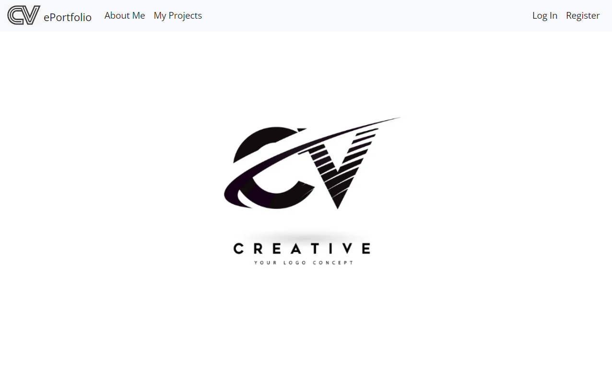
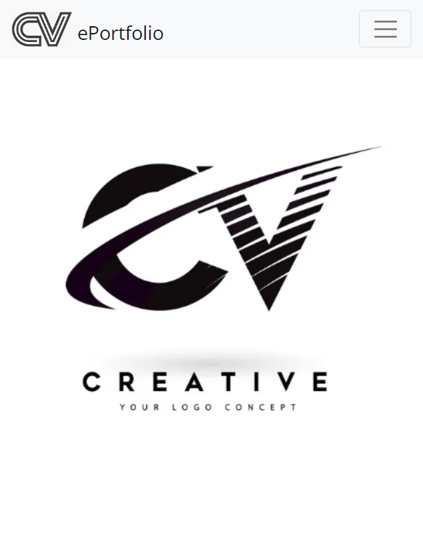

# Final Project: Capstone

Final Project from Edx | Harvard CS50's Web Programming with Python and JavaScript Course. 
[Specification](https://cs50.harvard.edu/web/2020/projects/final/capstone/)

### Description

__EPortfolio__ is a responsive, dynamic and most advanced web application that summarizes all my CS50's Web Programming 
with Python and JavaScript projects in one place. My application uses the Django plugin in Bootstrap mode. 
This application cost me the most work and was the most difficult to do. Anyone can see information about me, the course, 
and all my course projects. The EPortfolio application allows you to see the requirements of individual projects 
and watch a YouTube video showing them in action.


#### You can find a recording of my project on YouTube [here](https://youtu.be/YHsZMq5X5Dg)



## Project Overview

The final project incorporates elements from the following projects completed during the course:

### 0. [Project 0 - Google Search](https://github.com/rafinder1/search)
   - Design a front-end for Google Search, Google Image Search, and Google Advanced Search.

### 1. [Project 1 - Wikipedia-like Online Encyclopedia](https://github.com/rafinder1/wiki)
   - Develop an online encyclopedia akin to Wikipedia, with features for searching, editing, and creating new entries.

### 2. [Project 2 - eBay-like E-commerce Auction Site](https://github.com/rafinder1/commerce)
   - Create an eBay-like auction site enabling users to post listings, place bids, comment, and manage a watchlist.

### 3. [Project 3 - Email Client Front-end](https://github.com/rafinder1/mail)
   - Design the front-end of an email client that utilizes API calls to send and receive emails.

### 4. [Project 4 - Twitter-like Social Network](https://github.com/rafinder1/network)
   - Develop a social network website with features for making posts and following other users.

### 5. Project 5 - Custom Web Application
   - Design and implement a custom web application using Python and JavaScript.

### Installation
Windows:
1. First of all let's clone the repository:

```shell
git clone https://github.com/me50/rafinder1/tree/web50/projects/2020/x/capstone.git
```

2. In the root directory of the project (`cd capstone`), you can create a virtual environment using:

```shell
python3 -m venv venv
```

3. Then, to activate the virtual environment run:

```shell
venv/bin/activate.bat
```

4. And finally, to install all dependencies this project requires just run:

```shell
pip install -r requirements.txt
```

You should see a message saying that everything was installed.


### How to run? 
1. Go to the directory which contains "__manage.py__" file
2. Then type this command: 
3. ```shell
   python manage.py runserver
   ```
3. In your Web browser use a URL: __http://127.0.0.1:8000/__


#### Distinctiveness and Complexity
The idea was to create a website for a EPortfolio which would be responsive to mobile and desktop designs, 
and focused on creating a better user interface and experience.



__I believe that my final project meets the requirements and is different from the previous ones.
It is also the most complex and uses many new elements.__ ❤️
